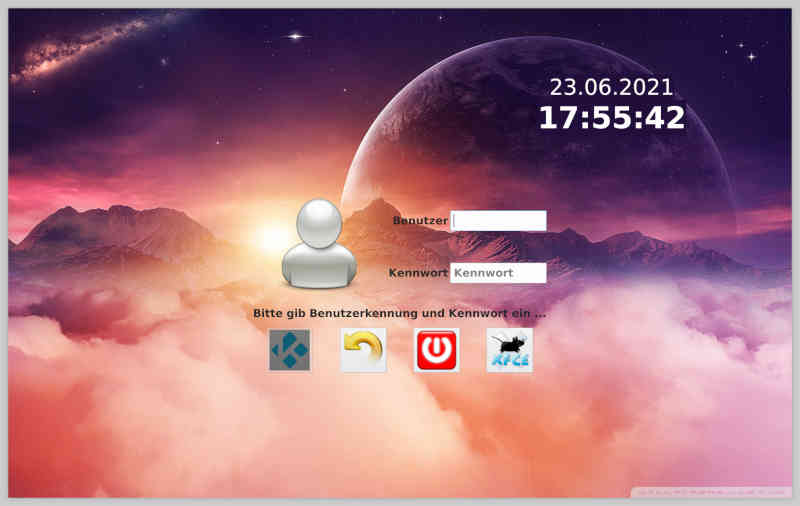

# lightdm-cinema-greeter

## History
I use a SOC for mediaplayer in home cinema, but login-options are not chooseable,
as upper and lower 10% of the screen are outside of my screen. I tried every greeter,
that is available at armbian, but none works without top menubar.

On my search for different lightdm greeters, I discovered
[Matt Fischer's example LightDM greeter](http://www.mattfischer.com/blog/archives/5),
which looked like a nice starting point, but it turned out, that greeters with python
don't work on armbian/xfce ...

So I started to write my own using vala, which I had to learn before. Vala is said
to use GTK and have a small footprint, so best for small systems.
This lightdm-greeter has been developed to run on [armbian legacy multimedia](https://forum.armbian.com/topic/16516-rk3399-legacy-multimedia-framework).
Finally - here it is - a simple lightdm-greeter without any top menubar.

## Screenshots

## Quickstart

download the package and run
  * make
  * sudo make install
  * reboot system to use lightdm-cinema-greeter

## Requirements

* requires [vala-compiler](https://wiki.gnome.org/Projects/Vala) (*valac*)

## Features
lightdm-cinema-greeter offers two different sessions to login. On SOC - mediacenter
needs to run without X-Session for lack of resources. Therefore armbian-legacy
multimedia provides a special compilation of Kodi (*kodi-gbm*).
If such a session is found, left login button will be enabled (screenshot shows
disabled button).

Buttons from left to right:
 * login to kodi-standalone
 * reboot
 * poweroff
 * login to xfce desktop

## Licenses
 * `share/planet_omega-wallpaper-1920x1200.jpg` [Copyright by Nicos23](http://wallpaperswide.com/planet_omega-wallpapers.html)
 * `share/xbmc.png` [GPLv2](https://www.gnu.org/licenses/old-licenses/lgpl-2.0.en.html)
 * `share/Xfce.png` [CC-BY-NC-SA](https://creativecommons.org/licenses/by-nc-sa/4.0/deed.en)
 * other icons [MIT or GPL](https://www.debian.org/license)

